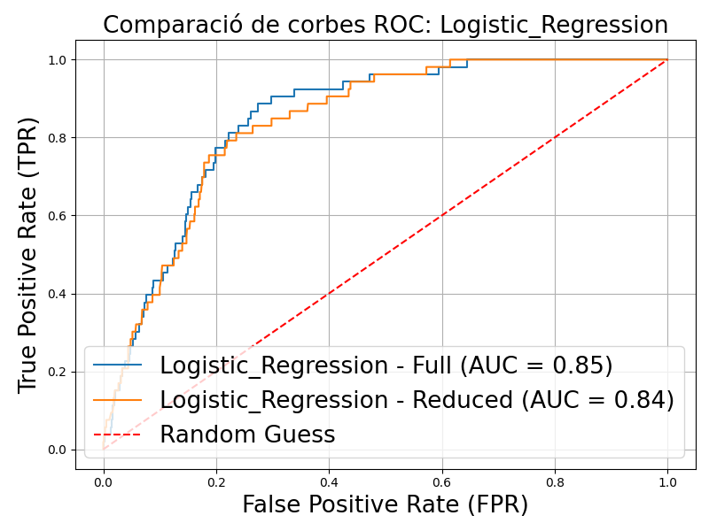
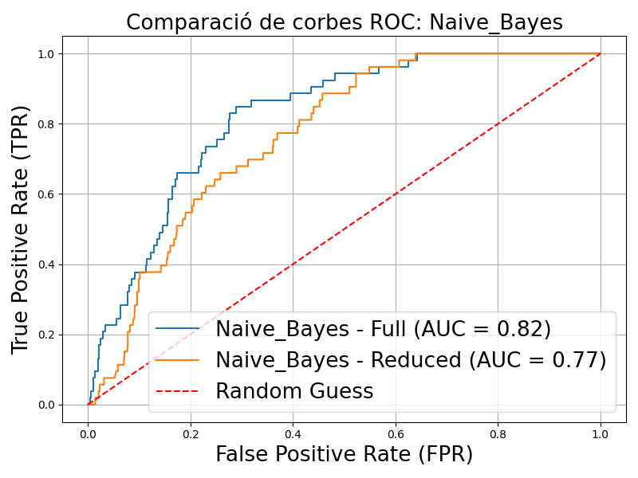

[](https://classroom.github.com/a/USx538Ll)
[](https://classroom.github.com/online_ide?assignment_repo_id=17032340&assignment_repo_type=AssignmentRepo)

# Detecció d'Ictus a Través de Models de Machine Learning

---

## **Objectiu del Projecte**
Aquest projecte té com a finalitat desenvolupar models de Machine Learning per detectar casos d'ictus (stroke) utilitzant dades clíniques. L'objectiu principal és determinar si els models poden identificar casos d'ictus amb precisió i si també poden fer-ho utilitzant exclusivament característiques que es poden mesurar a casa, sense la necessitat de proves mèdiques especialitzades. Aquest enfocament podria facilitar una detecció preliminar que permeti prevenir riscos de forma més accessible i eficient.

---

## **Dataset Utilitzat**
El dataset utilitzat prové de [Kaggle](https://www.kaggle.com/datasets/fedesoriano/stroke-prediction-dataset) i conté dades de 5.110 pacients amb les següent característiques:

1. **id**: Identificador únic del pacient.
2. **gender**: "Male", "Female" o "Other".
3. **age**: Edat del pacient.
4. **hypertension**: 0 si el pacient no té hipertensió, 1 si en té.
5. **heart_disease**: 0 si no té malalties cardíacques, 1 si en té.
6. **ever_married**: "No" o "Yes".
7. **work_type**: "children", "Govt_job", "Never_worked", "Private" o "Self-employed".
8. **Residence_type**: "Rural" o "Urban".
9. **avg_glucose_level**: Nivell mitjà de glucosa a la sang.
10. **bmi**: Índex de massa corporal.
11. **smoking_status**: "formerly smoked", "never smoked", "smokes" o "Unknown".
12. **stroke**: 1 si el pacient ha patit un ictus, 0 en cas contrari.

El dataset presentava un desbalanceig significatiu: només aproximadament 250 casos (5%) tenien `stroke = 1`. Aquest problema es va abordar aplicant **SMOTE** (Synthetic Minority Over-sampling Technique) per equilibrar les classes durant l'entrenament, garantint que les proves reflectissin la realitat i no un escenari artificialment balancejat.

---

## **Llibreries Utilitzades**
- `numpy`, `pandas`: Per a la gestió i manipulació de dades.
- `scikit-learn`: Per a la divisó de dades, implementació de models i càlcul de mètriques.
- `imblearn`: Per aplicar SMOTE.
- `matplotlib`, `seaborn`: Per a la generació de gràfics.
- **Mòduls personalitzats**:
  - `dataloader_module`: Carrega i prepara les dades.
  - `metrics_module`: Calcula les mètriques necessàries.
  - `graphs_module`: Genera gràfics com ROC curves.

---

## **Models de Classificació Provats**
1. Logistic Regression
2. K-Nearest Neighbors (KNN)
3. Naive Bayes
4. Random Forest
5. AdaBoost
6. XGBoost

Els models es van avaluar amb i sense les característiques que no són mesurables a casa "bmi", "avg_glucose_level", "age". Els criteris d'èxit incloïen la precisió (`accuracy`), el **recall** (prioritzat en aquest projecte), i l'àrea sota la corba ROC (AUC-ROC).

---

## **Reproducció del Projecte**

### **Requisits**
1. **Python 3.8+**.
2. Llibreries necessàries (es poden instal·lar amb `pip`):
   ```bash
   pip install -r requirements.txt
   ```

---

## **Resultats**
Els resultats inclouen:
- **Matrius de confusió** que mostren dels millors models:


- **ROC curves** que comparen tots els models amb les dades completes i amb les dades reduïdes:


- Comparatives de corbes ROC entre models:





### **Observació Inicial**
Els models mostren una disminució de la precisió quan es redueixen les característiques, tot i que encara és possible detectar ictus amb una fiabilitat raonable. Els models Random Forest i XGBoost van ser els més robustos, especialment quan es prioritzava el recall.

---

## **Conclusions**
1. És possible detectar casos d'ictus amb dades mesurables a casa, tot i que amb menys precisió que quan s'inclouen totes les característiques.
2. La priorització del recall és clau per minimitzar els falsos negatius, donada la gravetat d'un ictus no detectat.
3. Els models Random Forest i XGBoost presenten el millor compromís entre recall i precisió.

### **Millora Futura**
1. Incorporar dades addicionals per augmentar la robustesa dels models, especialment de casos positius (ictus).

---

## **Estructura del Repositori**
```plaintext
├── data/                     # Conté el dataset
├── not_implemented/          # Scripts o idees que no es van arribar a implementar pel temps o complexitat
├── notebooks_and_scripts/    # Notebooks dels diferents models utilitzats en el projecte per predir ictus
├── ROC_Data/                 # Conjunt de dades utilitzats per representar les ROC Curves
├── .gitignore                # Fitxer que exclou arxius del control de versions
├── README.md                 # Documentació principal
└── requirements.txt          # Llista de dependències 
```

Aquest README serveix com a guia per reproduir i comprendre el projecte, amb l'objectiu d'oferir un anàlisi complet i transparent del treball realitzat.

---
