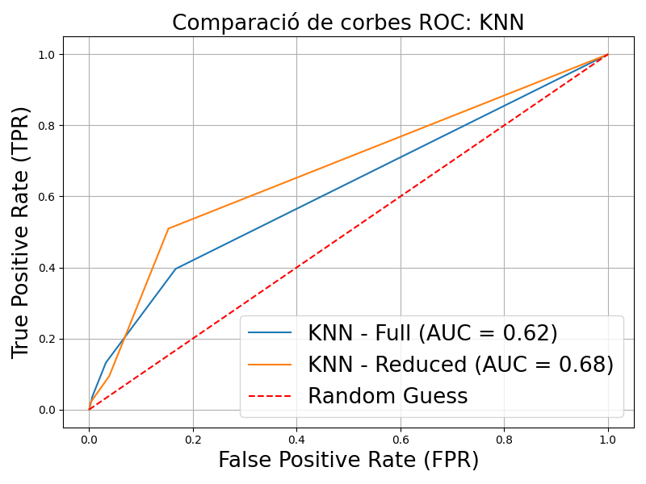
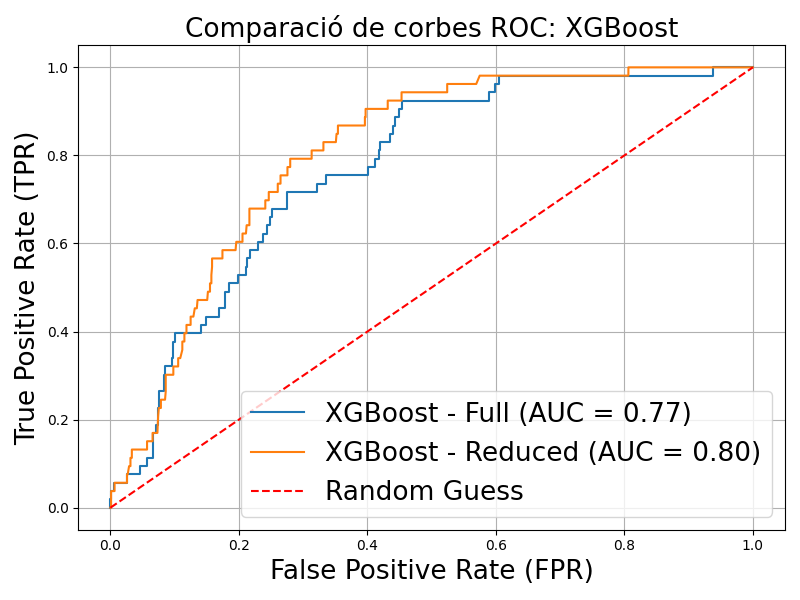

[](https://classroom.github.com/a/USx538Ll)
[](https://classroom.github.com/online_ide?assignment_repo_id=17032340&assignment_repo_type=AssignmentRepo)

# Detecció d'Ictus a Través de Models de Machine Learning

# **Context Mèdic**

L'ictus, o accident cerebrovascular, és una de les principals causes de mort i discapacitat arreu del món. Es produeix quan el subministrament de sang al cervell es veu interromput, causant danys cerebrals que poden ser irreversibles si no es detecten i tracten ràpidament. Hi ha dos tipus principals d'ictus: isquèmic (causat per un bloqueig) i hemorràgic (causat per un vessament de sang al cervell).

Factors de risc com hipertensió, diabetis, obesitat, hàbits de vida no saludables i antecedents mèdics familiars augmenten significativament la probabilitat de patir un ictus. Tot i això, moltes persones amb risc no tenen accés a diagnòstics preventius o assistència mèdica regular.

A través de l'ús de dades demogràfiques i mèdiques bàsiques, aquest projecte busca aprofitar la intel·ligència artificial per omplir aquest buit i oferir eines per a la detecció precoç i accessible, especialment en comunitats amb recursos limitats.

---
# **Objectius Del Projecte**

La detecció d'ictus és un repte crític en l'àmbit mèdic, ja que la seva identificació precoç pot salvar vides i reduir danys irreversibles. A través de l'ús de models de Machine Learning, aquest projecte pretén aportar una eina que ajudi a identificar pacients amb risc d'ictus a partir de dades clíniques i demogràfiques. 

El projecte posa especial èmfasi en dos aspectes:
1. **Accesibilitat**: Estudiar si models menys dependents de dades estrictament mèdiques poden oferir una detecció preliminar fiable.
2. **Eficàcia**: Prioritzar el record (recall) en les prediccions per assegurar una detecció òptima dels casos positius, reduint al mínim el risc de falsos negatius.

Aquest enfocament té el potencial d'ampliar l'abast de les eines diagnòstiques a entorns amb recursos limitats, oferint una solució preventiva que pugui salvar vides.

# **Planificació del Treball**

La planificació d'aquest projecte es va dividir en diverses fases per garantir un desenvolupament estructurat i eficient. Cada etapa es va completar seguint un cronograma preestablert i ajustant les tasques en funció dels resultats obtinguts i els desafiaments trobats. A continuació, es detallen les principals fases del projecte:

## **Fase 1: Preparació del Dataset**   
- **Tasques realitzades**:
  1. Exploració inicial del dataset per entendre les característiques i les seves distribucions.
  2. Tractament de valors manquants i anomalies, com dades extremes o inconsistents.
  3. Codificació de variables categòriques per facilitar el seu ús en models de Machine Learning.
  4. Divisió del dataset en conjunts d’entrenament, validació i test.
  5. Aplicació de tècniques per abordar el desbalanceig de classes, com SMOTE.

---

## **Fase 2: Selecció i Entrenament de Models**   
- **Tasques realitzades**:
  1. Definició dels algoritmes inicials a utilitzar: Logistic Regression, Random Forest, KNN, Naive Bayes, AdaBoost i XGBoost.
  2. Entrenament dels models amb els conjunts de dades preparats.
  3. Avaluació preliminar dels models utilitzant mètriques com Accuracy, Recall i AUC-ROC.
---

## **Fase 3: Optimització i Avaluació**  
- **Tasques realitzades**:
  1. Ajust del threshold dels models per prioritzar el recall en detriment d’altres mètriques, assegurant la detecció dels casos positius.
  2. Comparació dels resultats amb i sense certes característiques per identificar-ne l’impacte en el rendiment dels models.
  3. Generació de gràfics comparatius, com les corbes ROC i matrius de confusió, per analitzar les diferències entre models.
---


## **Fase 4: Visualització i Interpretació dels Resultats**  
- **Tasques realitzades**:
  1. Creació de gràfics de suport per il·lustrar els resultats obtinguts.
  2. Interpretació de les mètriques per destacar els punts forts i les limitacions de cada model.
  3. Redacció de conclusions basades en els resultats i en la viabilitat d’aplicar els models en entorns clínics i no clínics.
---

## **Fase 5: Redacció i Presentació**  
- **Tasques realitzades**:
  1. Documentació de tot el procés i resultats en aquest README.
  2. Preparació d’una presentació clara i concisa per exposar el projecte en 10 minuts, seguint un esquema lògic i amb suport visual.
  3. Assaigs previs de la presentació per ajustar el temps i anticipar preguntes.
---

## **Dataset Utilitzat**
El dataset utilitzat prové de [Kaggle](https://www.kaggle.com/datasets/fedesoriano/stroke-prediction-dataset) i conté dades de 5.110 pacients amb les següent característiques:

1. **id**: Identificador únic del pacient.
2. **gender**: "Male", "Female" o "Other".
3. **age**: Edat del pacient.
4. **hypertension**: 0 si el pacient no té hipertensió, 1 si en té.
5. **heart_disease**: 0 si no té malalties cardíacques, 1 si en té.
6. **ever_married**: "No" o "Yes".
7. **work_type**: "children", "Govt_job", "Never_worked", "Private" o "Self-employed".
8. **Residence_type**: "Rural" o "Urban".
9. **avg_glucose_level**: Nivell mitjà de glucosa a la sang.
10. **bmi**: Índex de massa corporal.
11. **smoking_status**: "formerly smoked", "never smoked", "smokes" o "Unknown".
12. **stroke**: 1 si el pacient ha patit un ictus, 0 en cas contrari.

El dataset presentava un desbalanceig significatiu: només aproximadament 250 casos (5%) tenien `stroke = 1`. Aquest problema es va abordar aplicant **SMOTE** (Synthetic Minority Over-sampling Technique) per equilibrar les classes durant l'entrenament, garantint que les proves reflectissin la realitat i no un escenari artificialment balancejat.

---

## **Llibreries Utilitzades**
- `numpy`, `pandas`: Per a la gestió i manipulació de dades.
- `scikit-learn`: Per a la divisó de dades, implementació de models i càlcul de mètriques.
- `imblearn`: Per aplicar SMOTE.
- `matplotlib`, `seaborn`: Per a la generació de gràfics.
- **Mòduls personalitzats**:
  - `dataloader_module`: Carrega i prepara les dades.
  - `metrics_module`: Calcula les mètriques necessàries.
  - `graphs_module`: Genera gràfics com ROC curves.

---
## **Models d'AC Aplicats**
1. Logistic Regression
2. Random Forest
3. Naive Bayes
4. K-Nearest Neighbors (KNN)
5. AdaBoost
6. XGBoost

Els models es van avaluar, per una banda amb totes les característiques, i per altra amb les següents columnes excloses:
- `bmi`
- `obesity`
- `avg_glucose_level`
- `hypertension`
- `heart_disease`

Els criteris d'èxit incloïen la accuracy, el recall (prioritzat en aquest projecte), i l'àrea sota la corba ROC (AUC-ROC) per a una supervisió d’un comportament esperat.

## **Justificació de la No Implementació de Grid Search**

Durant el desenvolupament del projecte, vam considerar la possibilitat d'utilitzar GridSearchCV per a la cerca d'hiperparàmetres amb l'objectiu de maximitzar tant el recall com l'accuracy de manera equilibrada. No obstant això, després de diverses proves i avaluacions, vam observar que la combinació d'aquestes dues mètriques en la cerca d'hiperparàmetres no produïa els resultats esperats.

En concret, vam trobar que:

- Mètriques Nefastes: Quan intentàvem maximitzar simultàniament el recall i l'accuracy, els models resultants presentaven   mètriques de rendiment subòptimes. Això es devia al fet que la combinació d'aquestes dues mètriques en una sola funció d'avaluació no reflectia adequadament el compromís necessari entre elles.

- Compromís entre Recall i Accuracy: Maximitzar el recall sovint implica acceptar un major nombre de falsos positius, mentre que maximitzar l'accuracy pot implicar un compromís en la detecció de casos positius. Aquest compromís inherent va dificultar la cerca d'una configuració d'hiperparàmetres que equilibrés ambdues mètriques de manera satisfactòria.

- Complexitat i Temps de Càlcul: La cerca d'hiperparàmetres amb GridSearchCV és computacionalment intensiva, especialment quan es treballa amb conjunts de dades grans i graelles d'hiperparàmetres extenses. Els resultats subòptims obtinguts no justificaven el temps i els recursos invertits en aquesta cerca.

Per aquestes raons, vam decidir no implementar GridSearchCV en la nostra metodologia final. En lloc d'això, vam optar per ajustar-ho manualment a través del threshold, prioritzant el recall per assegurar-nos que els casos positius fossin detectats de manera efectiva, mentre manteníem una accuracy acceptable.

Aquesta decisió ens va permetre obtenir models amb un millor rendiment global, adaptats a les necessitats específiques del projecte, sense comprometre excessivament cap de les dues mètriques clau.

# **Reproducció del Projecte**

Aquest apartat detalla com reproduir el projecte pas a pas i com accedir als resultats obtinguts. Hem dissenyat el projecte perquè sigui fàcil d'executar per a qualsevol persona amb coneixements bàsics de Python i Machine Learning.

## **Requisits**
1. **Python 3.8+**  
   Per executar els scripts i notebooks, cal tenir instal·lada una versió moderna de Python (3.8 o superior). Podeu descarregar-lo des de [python.org](https://www.python.org/).  

2. **Llibreries necessàries**  
   Les dependències es poden instal·lar fàcilment executant la següent comanda al terminal des del directori principal del projecte:  
   ```bash
   pip install -r requirements.txt

## **Resultats**
Els resultats inclouen:
- **Mètriques** dels millors models seleccionats:


- **Matrius de confusió** que mostren dels millors models:
<div style="display: flex; flex-wrap: wrap; gap: 10px;">
  
  
</div>

- **ROC curves** que comparen tots els models amb les dades completes i amb les dades reduïdes:


- Comparatives de corbes ROC entre models:

<div style="display: flex; flex-wrap: wrap; gap: 10px;">
  
  
  
  
  
  
</div>

### **Observació Inicial**
Els models mostren una disminució de la precisió quan es redueixen les característiques, tot i que encara és possible detectar ictus amb una fiabilitat raonable. Els models de Regressió Logística i XGBoost van ser els més robustos, especialment quan es prioritzava el recall.

---

## **Conclusions**
1. És possible detectar casos d'ictus amb dades que tenim, amb una Accuracy de 74% i un Recall del 89% per la regressió logística.
2. La priorització del recall és clau per minimitzar els falsos negatius, donada la gravetat d'un ictus no detectat.
3. És possible detectar ictus amb característiques mesurables a casa, encara que els valors de les mètriques disminueixin lleugerament, depenent del model.

### **Millora Futura**
1. Incorporar dades addicionals per augmentar la robustesa dels models, especialment de casos positius (ictus). Això inclou més tipus de dades (historial alimentari, activitat física, etc.), i cantitats més grans de dades de pacients amb ictus.

---

## **Estructura del Repositori**
```plaintext
├── data/                     # Conté el dataset
├── not_implemented/          # Scripts o idees que no es van arribar a implementar pel temps o complexitat
├── notebooks_and_scripts/    # Notebooks dels diferents models utilitzats en el projecte per predir ictus
├── ROC_Data/                 # Conjunt de dades utilitzats per representar les ROC Curves
├── .gitignore                # Fitxer que exclou arxius del control de versions
├── README.md                 # Documentació principal
└── requirements.txt          # Llista de dependències 
```

Aquest README serveix com a guia per reproduir i comprendre el projecte, amb l'objectiu d'oferir un anàlisi complet i transparent del treball realitzat.

---
